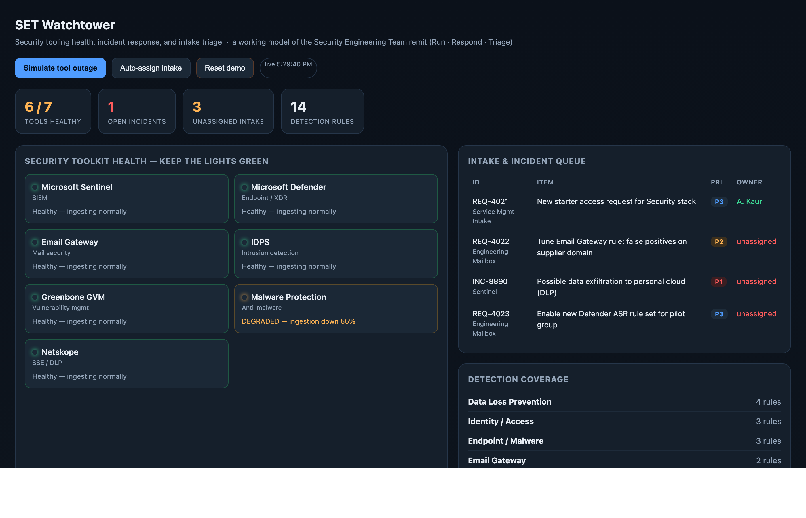

# SET Watchtower

> Know the moment a security tool goes blind — then respond and assign an owner.

**▶ Live demo:** https://mechmukul.github.io/set-watchtower/ · runs in your browser, nothing to install.



## What it is
An interactive console that does three things a security operations team does every day:
1. **Run** — shows the live health (green / amber / red) of every security tool in the estate.
2. **Respond** — raises a priority incident automatically when a tool stops reporting.
3. **Triage** — holds an intake queue (mailbox + service-management requests) and assigns each item an owner.

## Why it's useful
Detection tooling fails *silently*. When a SIEM connector or EDR agent stops ingesting, the alerts it
should raise simply never fire — and everyone assumes they are still protected. Most dashboards show
threats; this one first answers a more basic question: **"are our detections even running right now?"**

## Who it's for / use cases
- **SOC and security-engineering teams** wanting one "are our tools actually working?" view.
- **Managed security providers** running "keep the lights green" operations across client toolsets.
- **Team leads** who need every intake request to have a clear owner and no silent gaps.
- **A starting template** you can wire to real tool health APIs (Sentinel `Usage`/`SentinelHealth`, EDR agent status) instead of the bundled demo data.

## Try it live (30 seconds)
1. Open the live demo. Note one tool starts **degraded** on purpose.
2. Click **Simulate tool outage** → a tool goes silent and a **P1 incident** appears.
3. Click **Auto-assign intake** → every unowned request gets an owner.
4. Click **Reset demo** to start over.

## How it works
- Health is computed by simple, explicit rules: no heartbeat for >10 min = **red (silent)**; ingestion down ≥50% = **amber (degraded)**; otherwise **green**.
- Telemetry is simulated in-page so it runs offline; the same rules apply to real feeds.
- "Simulate outage" flips a tool to silent and pushes a P1 to the queue; "Auto-assign" distributes unowned items round-robin.

## Run locally
```bash
python3 -m http.server 8000   # then open http://localhost:8000
```
Or just open `index.html`.

## Tech & quality
Vanilla HTML/CSS/JS, zero dependencies. Detection content lives in
[`detections/detections.md`](detections/detections.md) — 14 Microsoft Sentinel/Defender KQL rules
(including 4 DLP and 2 tool-health rules) with tuning notes.

---
MIT licensed · Built by **Mukul Mech** · Companions: [set-triage-atlas](https://github.com/mechmukul/set-triage-atlas) · [gvm-triage](https://github.com/mechmukul/gvm-triage) · [set-runbooks](https://github.com/mechmukul/set-runbooks)
